[[English]](README_en.md)

# Rapid Roll new Edition

- Thử nghiệm game: 

# Giới thiệu game
  Rapid Roll với phiên bản đồ hoạ và điều khiển tốt nhất trên máy tính có 2 chế độ 
  Cuộc phiêu lưu của quả bóng qua các bậc thang để sinh tồn. Hãy là một phần của cuộc phiêu lưu đó ngay bây giờ! 
  Chế độ đồi kháng cho phép người chơi điều khiển quả bóng với súng để tấn công kẻ thù. 
  Đồ hoạ đẹp và dễ dàng, giao diện đơn giản và cơ chế trò chơi tuyệt vời!
#### Đặc biệt, game phát triển bot có thể tự di chuyển mà không bao giờ thua
- [0. Cách tải game](#0-cách-tải-game)
- [1. Bắt đầu game](#1-bắt-đầu-game)
- [2. Chọn trang phục](#2-chọn-trang-phục)
- [3. Chọn chế độ](#3-chọn-chế-độ)
- [4. Các thành phần trong game:](#4-các-thành-phần-trong-game)
- [5. Cách chơi](#5-cách-chơi)
    * [a. Chế độ sinh tồn](#a-chế-độ-sinh-tồn)
    * [b. Chế độ đối kháng](#b-chế-độ-đối-kháng)
- [5. Thất bại và điểm số](#5-thất-bại-và-điểm-số)
- [6. Source code game](#6-source-code-game)
  * [Đánh giá tính trong sáng của code và khả năng phát triển thêm tính năng mới](#đánh-giá-tính-trong-sáng-của-code-và-khả-năng-phát-triển-thêm-tính-năng-mới)
  * [Vấn đê còn tốn tại](#vấn-đề-còn-tồn-tại)
- [7. Thuật toán auto](#7-thuật-toán-auto)

# 0. Cách tải game

Tải game (được nén thành .zip) tại link
sau: https://github.com/phan-tho/RapidRoll/releases/tag/v2.0.1 
Khoảng 10MB 
Giải nén game và và vào thư mục BongCuoi.app để chơi 

# 1. Bắt đầu game
### Màn hình chính của game gồm các thông tin người chơi và lựa chọn:
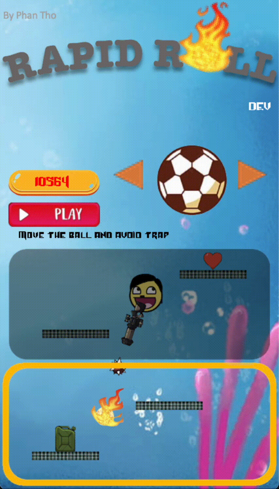  
|                                                                          	     | Chức năng                                  |
|------------------------------------------------------------------------------|-----------------------------------------------|
|         | Hiển thị tên người chơi                         |
|      | Click chuột vào tên để đổi tên                           |
| 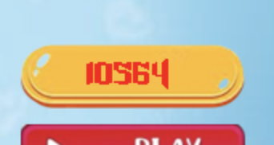      | Hiển thị điểm cao nhất của chế độ đang chọn của người chơi  |
| 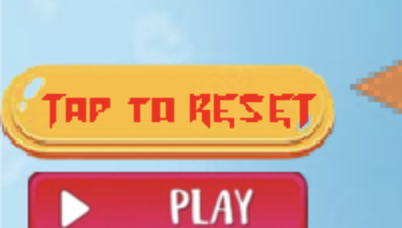 | Click chuột vào ô này để làm mới điểm cao nhất |

# 2. Chọn trang phục

Click sang trái hoặc sang phải để thay đổi trang phục   

# 3. Chọn chế độ
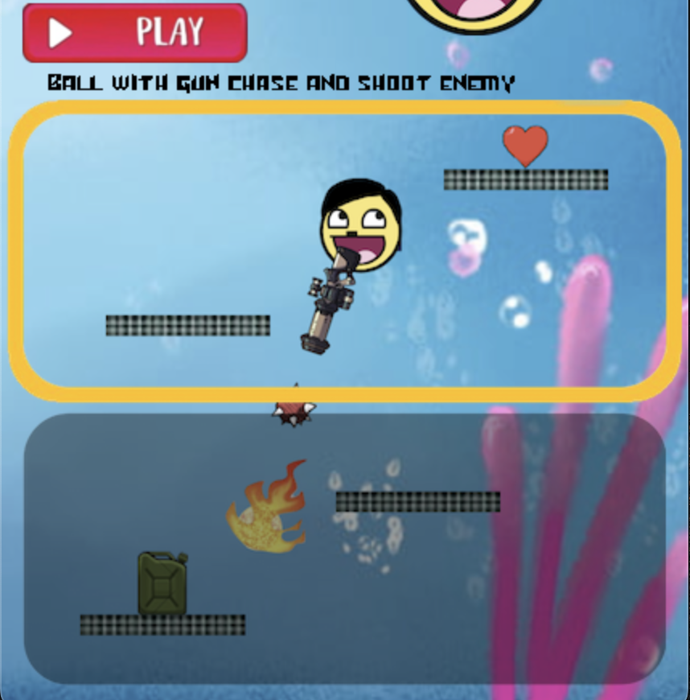
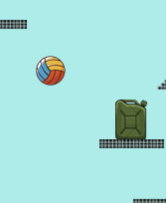
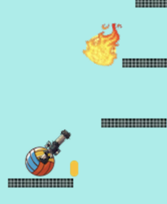    
Click chuột vào 1 trong 2 chế độ    
Hiển thị hướng dẫn của chế độ được chọn.    

# 4. Các thành phần trong game
|                                                        	     | Thuộc tính                                  |
|--------------------------------------------------------------|-----------------------------------------------|
| 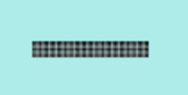     | Di chuyển lên trên. Quả bóng có thể nằm bên trên   |
| 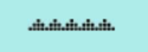      | Di chuyển lên trên. Quả bóng sẽ chết khi chạm vào |
| 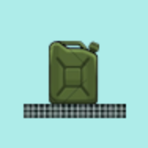      | Nạp năng lượng khi ăn để kích hoạt động cơ phản lực bay lên trên |
| 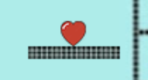     | Tăng số mạng khi ăn |

| Nút                                                   	     | Chức năng                                  |
|--------------------------------------------------------------|-----------------------------------------------|
| 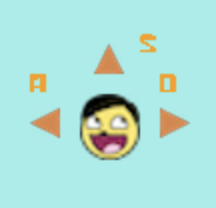  | Hiển thị hướng di chuyển khi ấn nút      |
|      | Tạm dừng trò chơi |
|       | Tiếp tục chơi |
|     | Chơi lại |
|       | Thoát trò chơi, trở về menu |
|  | Chế độ tự động đang tắt. Click để bật    |
|   | Chế độ tự động đang bật. Click để tắt  |

# 5. Cách chơi
Di chuyển sang trái, sang phải hoặc làm chậm tốc độ rơi để đứng trên các khối, 
ăn trái tim và né bẫy.

## a. Chế độ sinh tồn

 Người chơi có 3 mạng khi mới vào game  
Người chơi nhảy lên các block để không bị rơi xuống gai, ăn tim để tăng số mạng.  
Điểm được tính theo quãng đường di chuyển được.  

### Người chơi có thể click vào nút auto để máy tự động chơi.

## b. Chế độ đối kháng
### Chế độ 2 người chơi

Người chơi thứ 2 điều khiển quả bóng để chạy khỏi người chơi thứ 2  
Người chơi thứ nhất điều khiển quả bóng với súng để bắn người chơi thứ nhất  
Người chơi thứ 2 chết khi trúng đạn và có thể hồi sinh vô hạn.  
Điểm số được tính theo số mạng hạ gục.   

### Có thể chọn auto để bot điều khiển người chơi thứ nhất

# 5. Thất bại và điểm số
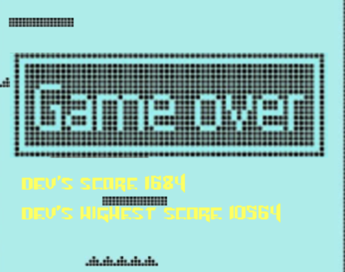
  Người chơi sẽ chết khi mạng bằng 0  
Màn hình hiển thị điểm người chơi và điểm cao nhất  

# 6. Source code game
- Folder HandleITEM:
    * Folder ITEM.h: Chứa class các item gồm các thông số, hàm di chuyển, hiển thị và xử lí các sự kiện.
    * File Button.h: Hiển thị và xử lí các nút tạm dừng, tiếp tục, chơi lại và thoát.
    * File CheckCollide.h: Kiểm tra va chạm giữa các vật thể.
      + Sử dụng thuật toán tìm kiếm nhị phân để tìm vật thể có toạ độ Y gần với quả bóng
      + Kiểm tra điều kiện va chạm với X.
- Folder Menu: Hiển thị và xử lí menu cho phép người dùng tuỳ chọn các chế độ và các thông tin khác.
- File Game.h: Khởi tạo các item như block, bẫy, tim, bình xăng và xử lí 1 số sự kiện đơn giản
    * Block và Trap được lưu trong cấu trúc dữ liệu std::deque.
    * Deque cho phép truy xuất tất cả các phần tử, thêm và xoá phần từ ở cả đầu và cuối.
- File BasicMode.h: class BasicMode kế thừa từ class Game.h phát triển thêm 1 số chức năng như chế độ tự động
- File ShootingMode.h: kế thừa từ class Game khởi tạo 2 quả bóng cho 2 người chơi, thêm tính năng xử lí sự kiện của bóng và đạn
- File LTexture.h: Tham khảo tại [http://lazyfoo.net](http://lazyfoo.net) và phát triển thêm nhiều hàm với chức năng vượt trội hơn.

- Hàm main.cpp: Chỉ khởi tạo của sổ và gọi class MainMenu
  
### Đánh giá tính trong sáng của code và khả năng phát triển thêm tính năng mới
- Định nghĩa class LTexture giúp dễ dàng đọc file ảnh và render ra màn hình.
- Code được chia nhiều file thực hiện từng nhiệm vụ.
- Tất cả vật thể được định nghĩa bằng class
  * Dễ dàng phát triển tính năng mới
  * Code dễ đọc, dễ sửa
  * Dễ dàng tái sử dụng
  * Các vật thể có chung thuộc tính được kế thừa từ class cơ sở
  * Các thuộc tính được đóng gói, an toàn khi gọi
- Từ class Game cơ sở và các class item có thể dễ dàng tạo ra các chế độ mới
- Bộ nhớ được kiểm soát RẤT TỐT
  * Bộ nhớ lập tức được giải phóng khi không sử dụng.
  * File phương tiện được tái sử dụng cho nhiều mục đích
  * DUNG LƯỢNG của ứng dụng chỉ 15MB.
  * Lượng RAM tiêu thụ TỐI ĐA là DƯỚI 50MB.
### Vấn đề còn tồn tại
#### Tuy cấu trúc code rõ ràng và dễ quản lí đối với cá nhân người viết nhưng 1 số kĩ năng cần cải thiện để làm việc nhóm.
- Chia mỗi class thành 1 file header và 1 file .cpp để tách biệt việc triển khai và sử dụng
  * Tuy đã tìm kiếm nhiều cách sửa lỗi trên internet nhưng chưa giải quyết được lỗi khi chia class thành 2 file
- Việc load icon cho game tiêu tốn quá nhiều RAM
  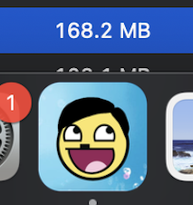
  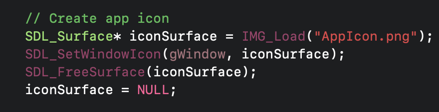
  * Ram game tiêu tốn ở mức 40MB nhưng tăng lên thành 150MB khi load icon cho game.
  * Mong rằng thông qua việc kiểm tra đánh giá có thể khắc phục được lỗi này 
# 7. Thuật toán auto
### Mục tiêu của bóng là di chuyển đến các block và né bẫy
- Tìm kiếm các block có thể tới và điều chỉnh hướng đi của bóng.
- Né bẫy khi nằm trong vùng nguy hiểm  
- Ta định nghĩa vận tốc theo phương thẳng của bóng là Vy  
- Vận tốc theo phương ngang của bóng là Vx
## Điều hướng bóng đến block có thể đến
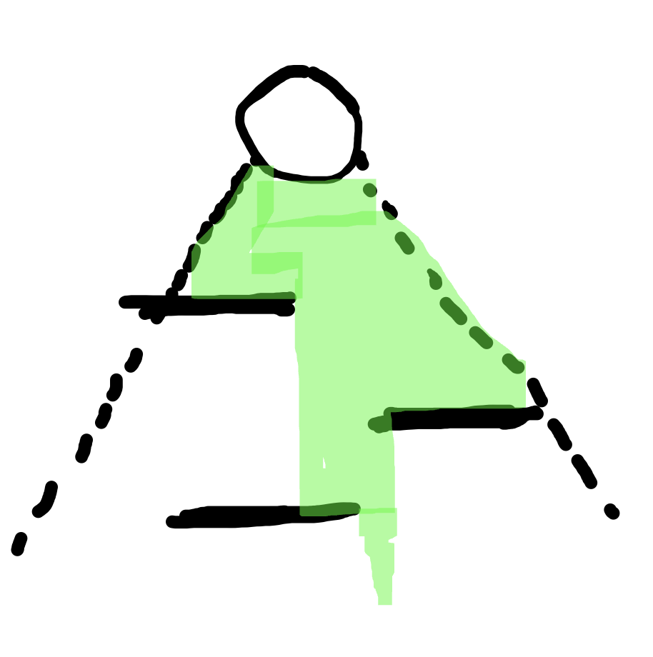  
Bóng có thể đi được trong 1 phạm vi có dạng hình tam giác có tỉ lệ đường cao trên chiều rộng tỉ lệ với Vy trên Vx  
Xác định block có thể đi đến và điều hướng bóng dụa theo tương quan với block ấy  

## Né bẫy
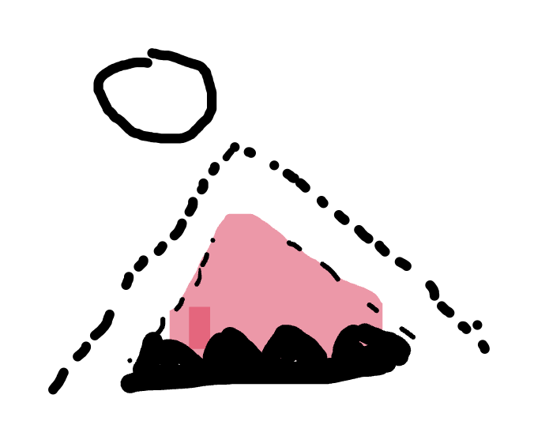  
Vùng nguy hiểm của 1 cái bẫy có dạng hình tam giác có tỉ tỉ lệ đường cao trên chiều rộng tỉ lệ với Vy trên Vx  
Điều hướng bóng trước khi nó đi vào vùng nguy hiểm  
