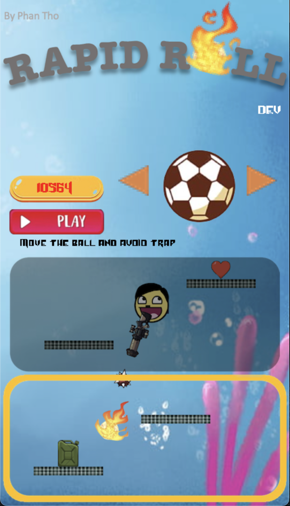

[[English]](README_en.md)

# Rapid Roll new Edition

- Thử nghiệm game: 

# Giới thiệu game
  Rapid Roll với phiên bản đồ hoạ và điều khiển tốt nhất trên máy tính có 2 chế độ 
  Cuộc phiêu lưu của quả bóng qua các bậc thang để sinh tồn. Hãy là một phần của cuộc phiêu lưu đó ngay bây giờ! 
  Chế độ đồi kháng cho phép người chơi điều khiển quả bóng với súng để tấn công kẻ thù. 
  Đồ hoạ đẹp và dễ dàng, giao diện đơn giản và cơ chế trò chơi tuyệt vời!
#### Đặc biệt, game phát triển bot có thể tự di chuyển mà không bao giờ thua
- [0. Cách tải game](#0-cách-tải-game)
- [1. Bắt đầu game](#1-bắt-đầu-game)
- [2. Chọn trang phục](#2-chọn-trang-phục)
- [3. Chọn chế độ](#3-chọn-chế-độ)
- [4. Các thành phần trong game:](#4-các-thành-phần-trong-game)
- [5. Cách chơi](#5-cách-chơi)
    * [a. Chế độ sinh tồn](#a-chế-độ-sinh-tồn)
    * [b. Chế độ đối kháng](#b-chế-độ-đối-kháng)
- [5. Thất bại và điểm số](#5-thất-bại-và-điểm-số)
- [Về đồ họa của game:](#về-đồ-họa-của-game)
- [Về source code game](#về-source-code-game)

# 0. Cách tải game

Tải game (được nén thành .zip) tại link
sau: https://github.com/phan-tho/RapidRoll/releases/tag/v2.0.1 
Khoảng 10MB 
Giải nén game và và vào thư mục BongCuoi.app để chơi 

# 1. Bắt đầu game
### Màn hình chính của game gồm các thông tin người chơi và lựa chọn:
  
|                                                                          	     | Chức năng                                  |
|------------------------------------------------------------------------------|-----------------------------------------------|
|         | Hiển thị tên người chơi                         |
|      | Click chuột vào tên để đổi tên                           |
|       | Hiển thị điểm cao nhất của chế độ đang chọn của người chơi  |
|  | Click chuột vào ô này để làm mới điểm cao nhất |

# 2. Chọn trang phục

Click sang trái hoặc sang phải để thay đổi trang phục   

# 3. Chọn chế độ
  
### Click chuột vào 1 trong 2 chế độ  
### Hiển thị hướng dẫn của chế độ được chọn.    
  
  

# 4. Các thành phần trong game
|                                                        	     | Thuộc tính                                  |
|--------------------------------------------------------------|-----------------------------------------------|
|       | Hiển thị tên người chơi                         |
|        | Click chuột vào tên để đổi tên                           |
|       | Hiển thị điểm cao nhất của chế độ đang chọn của người chơi  |
|      | Click chuột vào ô này để làm mới điểm cao nhất |

| Nút                                                   	     | Chức năng                                  |
|--------------------------------------------------------------|-----------------------------------------------|
|   | Hiển thị hướng di chuyển khi ấn nút                         |
|      | Tạm dừng trò chơi |
|      | Tiếp tục chơi |
|      | Chơi lại |
|      | Thoát trò chơi, trở về menu |
|        | Chế độ tự động đang tắt. Click để bật                           |
|       | Chế độ tự động đang bật. Clik để tắt  |

# 5. Cách chơi
Di chuyển sang trái, sang phải hoặc làm chậm tốc độ rơi để đứng trên các khối, 
ăn trái tim và né bẫy.

## a. Chế độ sinh tồn

## b. Chế độ đối kháng

# 5. Thất bại và điểm số

